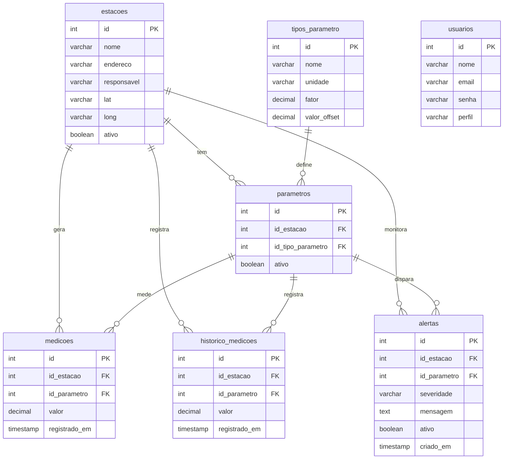

# EnviroSense

Sistema de Coleta e Monitoramento de Dados de Estações Meteorológicas  
API de Programação Integrada · 4º DSM · Fatec São José dos Campos · 2026-1

---

## Sobre o Projeto

A Tecsus é uma empresa especializada na coleta e processamento de dados por meio de redes de sensores sem fio (IoT), atuando principalmente no monitoramento de utilidades como água, energia e gás.

Com o objetivo de expandir seu portfólio para o monitoramento ambiental, a empresa propôs o desenvolvimento de estações meteorológicas de baixo custo, capazes de medir parâmetros como direção e velocidade do vento, índice pluviométrico, umidade, temperatura e pressão atmosférica.

Os dados coletados pelas estações são enviados periodicamente a um servidor central, onde são recepcionados, armazenados e disponibilizados em um portal web com dashboards interativos e relatórios para análise.

**Perfil de cliente escolhido:** Órgão público (Defesa Civil) — demanda nacional, manutenção facilitada e conformidade com padrões governamentais.

---

## Equipe

| Integrante | Função | LinkedIn | GitHub |
|-----------|--------|----------|--------|
| Carlos Intrieri | Desenvolvedor | [linkedin.com/in/carlosintrieri](https://www.linkedin.com/in/carlosintrieri/) | [github.com/carlosintrieri](https://github.com/carlosintrieri) |

---

## Tecnologias

| Camada | Tecnologia |
|--------|-----------|
| Frontend | React 18 + Vite + Bootstrap 5 |
| Backend | Node.js + Express |
| Banco de Dados | PostgreSQL (Azure) + MongoDB |
| Autenticação | JWT (jsonwebtoken + bcryptjs) |
| IoT | Python + MQTT (broker.emqx.io) |
| Gráficos | Chart.js |
| Notificações | React Toastify |
| Deploy | Azure App Service + GitHub Actions |

---

## Arquitetura IoT

```
Simulador Python
    → publica via MQTT (broker.emqx.io)
        → Receptor Python recebe
            → salva na tabela medicoes (PostgreSQL Azure)
            → salva no historico_medicoes (permanente)
            → atualiza alertas para crítico se valor extremo
                → Backend Node.js expõe via API REST
                    → Frontend React busca a cada 10 segundos
                        → Dashboard exibe gráficos Chart.js por parâmetro
                        → Toastify dispara notificação para valores extremos
```

---

## Modelo de Entidade-Relacionamento (MER)



---

## Estrutura do Projeto

```
envirosense/
├── backend/
│   ├── server.js
│   ├── conexao.js
│   ├── setup.js
│   ├── models/
│   │   ├── EstacaoModel.js
│   │   ├── ParametroModel.js
│   │   ├── TipoModel.js
│   │   ├── MedicaoModel.js
│   │   ├── AlertaModel.js
│   │   └── UsuarioModel.js
│   ├── controllers/
│   └── rotas/
├── frontend/
│   └── src/
│       ├── App.jsx
│       └── pages/
│           ├── Dashboard.jsx
│           ├── Estacoes.jsx
│           ├── Parametros.jsx
│           ├── Medicoes.jsx
│           ├── Alertas.jsx
│           └── Usuarios.jsx
└── mqtt/
    ├── simulador.py
    └── receptor.py
```

---

## Como Rodar o Projeto

### Pré-requisitos

- Node.js 18 ou superior instalado
- Python 3.10 ou superior instalado
- PostgreSQL instalado e rodando (ou acesso ao Azure PostgreSQL)
- Conta no MongoDB Atlas (ou MongoDB local)

---

### Backend

**1. Entre na pasta do backend:**
```bash
cd backend
```

**2. Instale as dependências:**
```bash
npm install
```

As dependências instaladas incluem: `express`, `dotenv`, `pg`, `pg-pool`, `mongoose`, `jsonwebtoken`, `bcryptjs`, `cors`.

**3. Crie o arquivo `.env` a partir do exemplo:**
```bash
copy .env.example .env
```

**4. Abra o `.env` e preencha com suas credenciais:**
```
PG_HOST=localhost
PG_PORT=5432
PG_USER=postgres
PG_PASSWORD=sua_senha_aqui
PG_DATABASE=enviro
MONGO_URL=mongodb://localhost:27017/enviro
JWT_SECRET=chave_secreta_qualquer
PORT=3001
```

**5. Crie o banco e as tabelas:**
```bash
node setup.js
```

**6. Inicie o servidor:**
```bash
node server.js
```

O backend estará rodando em `http://localhost:3001`

---

### Frontend

**1. Entre na pasta do frontend:**
```bash
cd frontend
```

**2. Instale as dependências:**
```bash
npm install
```

As dependências instaladas incluem: `react`, `react-dom`, `vite`, `@vitejs/plugin-react`, `bootstrap`, `bootstrap-icons`, `chart.js`, `react-toastify`.

**3. Se precisar instalar dependências individualmente:**
```bash
npm install chart.js
npm install react-toastify
npm install bootstrap bootstrap-icons
```

**4. Para rodar em modo de desenvolvimento:**
```bash
npm start
```

O frontend estará disponível em `http://localhost:5173`

**5. Para gerar o build de produção:**
```bash
npm run build
```

O build gerado em `dist/` é servido automaticamente pelo backend em `http://localhost:3001`

---

### MQTT (IoT)

**1. Instale as dependências Python:**
```bash
pip install paho-mqtt psycopg2-binary python-dotenv requests
```

**2. Terminal 1 — Receptor (inicia primeiro):**
```bash
cd mqtt
python receptor.py
```

**3. Terminal 2 — Simulador:**
```bash
cd mqtt
python simulador.py
```

O receptor precisa estar rodando antes do simulador. O simulador publica medições a cada 10 segundos via MQTT e o receptor salva no PostgreSQL.

---

### Ordem de inicialização recomendada

```
Terminal 1 → cd backend  && node server.js
Terminal 2 → cd mqtt     && python receptor.py
Terminal 3 → cd mqtt     && python simulador.py
Terminal 4 → cd frontend && npm start   (desenvolvimento)
```

Em produção, o frontend já está embutido no build servido pelo backend na porta 3001.

---

### Credenciais padrão

| Perfil | E-mail | Senha |
|--------|--------|-------|
| Administrador | admin@enviro.com | admin123 |
| Público | publico@enviro.com | publico123 |

---

## Backlog do Produto

### Legenda de Prioridade

| Nível | Significado |
|-------|------------|
| 1 | Alta — essencial para o funcionamento do sistema |
| 2 | Média — importante, mas não bloqueia o core |
| 3 | Baixa — agrega valor, pode ser entregue depois |

### Legenda de Estimativa

| Faixa | Significado |
|-------|-------------|
| 1 a 3 | Simples — poucos dias |
| 4 a 6 | Médio — uma sprint |
| 7 a 9 | Complexo — mais de uma sprint |

---

### Controle de Acesso e Usuários

| # | História de Usuário | Critérios de Aceitação | Prioridade | Estimativa |
|---|---------------------|------------------------|------------|------------|
| 01 | Como administrador, quero fazer login com e-mail e senha, para acessar as funcionalidades restritas do sistema. | Autenticação com JWT; bloqueio após tentativas inválidas; redirecionamento ao painel admin. | 1 | 4 |
| 02 | Como administrador, quero cadastrar, editar e remover usuários, para controlar quem acessa o sistema. | CRUD completo de usuários; definição de nível de acesso (admin ou público); confirmação antes de exclusão. | 1 | 5 |
| 03 | Como usuário público, quero acessar o portal sem login, para visualizar dados meteorológicos sem necessidade de cadastro. | Acesso à página pública sem autenticação; dados sensíveis e configurações não visíveis. | 1 | 2 |

---

### Estações e Sensores

| # | História de Usuário | Critérios de Aceitação | Prioridade | Estimativa |
|---|---------------------|------------------------|------------|------------|
| 04 | Como administrador, quero cadastrar estações meteorológicas com seus respectivos sensores e parâmetros, para que o sistema reconheça e processe os dados recebidos. | CRUD de estações; vinculação de múltiplos sensores por estação; suporte a diferentes tipos de parâmetros. | 1 | 7 |
| 05 | Como administrador, quero editar e desativar estações, para gerenciar o ciclo de vida dos dispositivos. | Edição de nome, localização e sensores; status ativo/inativo; histórico de alterações. | 2 | 4 |
| 06 | Como administrador, quero visualizar no mapa a localização das estações cadastradas, para ter visão geográfica da cobertura do sistema. | Mapa interativo com marcadores por estação; clique no marcador exibe dados básicos da estação. | 3 | 6 |

---

### Recepção e Armazenamento de Dados

| # | História de Usuário | Critérios de Aceitação | Prioridade | Estimativa |
|---|---------------------|------------------------|------------|------------|
| 07 | Como sistema, quero receber os dados enviados pelas estações via API, para armazená-los de forma estruturada no banco de dados. | Endpoint de recepção de dados; validação do payload; armazenamento com timestamp; suporte a falhas de envio sem perda de dados. | 1 | 8 |
| 08 | Como administrador, quero utilizar um simulador de datalogger, para testar a recepção de dados sem precisar de hardware físico. | Simulador envia dados em intervalos configuráveis; suporta múltiplos parâmetros; log de envios visível. | 1 | 7 |

---

### Dashboards

| # | História de Usuário | Critérios de Aceitação | Prioridade | Estimativa |
|---|---------------------|------------------------|------------|------------|
| 09 | Como usuário público, quero visualizar um dashboard com os dados meteorológicos em tempo real, para acompanhar as condições climáticas. | Gráficos de temperatura, umidade, vento e chuva; atualização automática; seleção de estação e período. | 1 | 8 |
| 10 | Como usuário público, quero ver indicadores estatísticos nos dashboards (média, máxima, mínima), para entender melhor o comportamento dos dados. | Exibição de média, máxima e mínima por parâmetro; cálculo por período selecionado. | 2 | 5 |
| 11 | Como administrador, quero comparar dados entre estações em um mesmo dashboard, para identificar variações regionais. | Seleção de múltiplas estações; sobreposição de gráficos; legenda clara por estação. | 3 | 7 |

---

### Alertas

| # | História de Usuário | Critérios de Aceitação | Prioridade | Estimativa |
|---|---------------------|------------------------|------------|------------|
| 12 | Como administrador, quero configurar alertas baseados em limites de parâmetros meteorológicos, para ser notificado automaticamente em situações críticas. | CRUD de alertas; definição de parâmetro e valor limite; associação a uma estação específica. | 1 | 7 |
| 13 | Como usuário público, quero receber notificações de alertas ativos no portal, para me manter informado sobre condições climáticas extremas. | Exibição de alertas ativos na interface via Toastify; indicação do parâmetro, estação afetada e valor extremo detectado. | 2 | 4 |

---

### Relatórios

| # | História de Usuário | Critérios de Aceitação | Prioridade | Estimativa |
|---|---------------------|------------------------|------------|------------|
| 14 | Como administrador, quero gerar um relatório de histórico de dados por estação e período, para análise detalhada das coletas. | Filtros por estação, parâmetro e intervalo de datas; exportação em PDF ou CSV. | 2 | 6 |
| 15 | Como administrador, quero gerar um relatório de alertas disparados, para auditar ocorrências críticas. | Listagem de alertas com data, parâmetro, valor registrado e estação; filtros por período. | 2 | 5 |
| 16 | Como administrador, quero gerar um relatório comparativo entre estações, para identificar padrões e anomalias regionais. | Comparação de parâmetros entre duas ou mais estações; gráficos e tabela resumo. | 3 | 7 |

---

### Infraestrutura e Qualidade

| # | História de Usuário | Critérios de Aceitação | Prioridade | Estimativa |
|---|---------------------|------------------------|------------|------------|
| 17 | Como time de desenvolvimento, quero um pipeline de integração contínua configurado, para automatizar testes e validações a cada push. | CI rodando a cada push na main; testes automatizados obrigatórios antes do deploy; relatório de cobertura. | 1 | 5 |
| 18 | Como time de desenvolvimento, quero deploy automatizado configurado por ambiente, para garantir entregas consistentes e sem intervenção manual. | Deploy automático no Azure App Service a cada merge na main via GitHub Actions. | 2 | 6 |
| 19 | Como desenvolvedor externo, quero uma documentação completa da API, para integrar outros sistemas ao EnviroSense. | Documentação de todas as rotas com exemplos de request/response; disponível via Swagger ou Postman. | 2 | 4 |

---

## Sprints

| Sprint | Período | Entrega |
|--------|---------|---------|
| Sprint 1 | 08/04/2026 | CRUD de Estações, Tipos de Parâmetros, Parâmetros, Alertas e Usuários |
| Sprint 2 | 06/05/2026 | Autenticação JWT, modal em 2 etapas, vinculação de tipos às estações |
| Sprint 3 | 27/05/2026 | Alertas em tempo real via MQTT com escalamento automático para crítico, aba de Medições alimentada pelo receptor Python com histórico permanente em tabela separada, aba Dashboard com gráficos em tempo real por parâmetro usando Chart.js e notificações Toastify para valores extremos |

Desenvolvido por Equipe Lone Wolf · Fatec São José dos Campos · 2026
